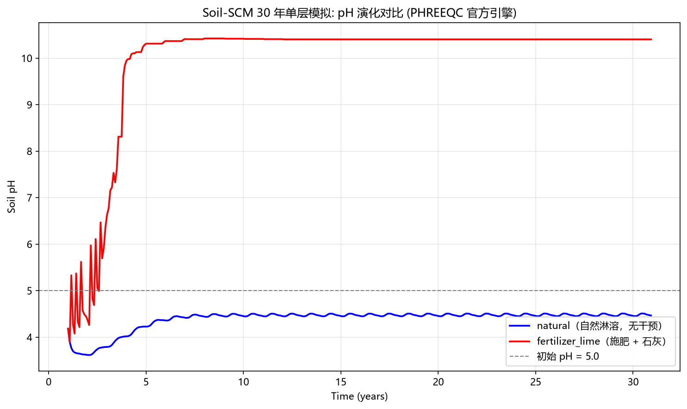

# Soil-SCM 用户指南（USERGUIDE）

> **适用版本**：**v0.7.2**（2026-08-31 更新发布：工单 83 深层 CEC/BS 物理化 + 工单 84 验证探针与 natural 碱化归因 + 工单 85 30y 权威基线 + 工单 87 深层极端酸化物理化 + 工单 86 L4 收敛分层架构；365 测试）+ v0.7.1（工单 82，30y 全量解锁）+ 地球化学深化（工单 77/78/80）
> **配套文档**：项目总览与开发历史见 `README.md`；已知模型局限的科学细节见 `docs/reports/V0_3_0_FINAL_REPORT.md`。
> 本文面向**使用该模型的科研人员**：讲解如何安装、配置、运行模拟并解读输出结果，末尾附常见问题排查与开发者速览。

---

## 一、简介与适用范围

**Soil-SCM** 是一个基于 **PHREEQC 地球化学引擎**的**土壤物理化学单点数值模式**，用于模拟**长期（数十年）** 施肥、酸化、淋溶、石灰改良与气候变化情景下土壤化学的演变，主要输出指标包括：

- **土壤 pH**
- **盐基饱和度**（base saturation，%）
- **阳离子交换量占用**（CEC occupied）
- **交换性钙 / 交换性铝**（及矿物相、溶液离子等扩展变量）

### 能模拟什么

| 过程 | 说明 |
|------|------|
| 自然淋溶 | 降水入渗（含酸雨化学组分）带走盐基，土壤酸化 |
| 施肥 | 氮磷钾镁锌肥（N/P₂O₅/K₂O/MgO/ZnSO₄），含尿素水解→硝化产酸 |
| 石灰改良 | 生石灰（CaO）施入中和酸性、补充交换性钙 |
| 气候变化 | 降水年递增 / 温度年递增对淋溶与土壤 CO₂ 分压的影响 |
| 多分层 | 可选 1~4 层垂直剖面，模拟上层排水的级联下渗 |

### 边界与适用性（务必先读）

1. **单点模式**：模拟单位面积（ha）土柱的化学演变，**不含**空间分布、作物根系吸水与有机质分解（均在扩展规划中）。
2. **施肥单层长期模拟存在已知局限**：单层排水会导致交换性铝（AlX₃）淋洗耗尽，`fertilizer`/`fertilizer_lime` 情景**约第 3~4 年 pH 突升至 ~10**（本指南第 6 章案例可复现）。**建议干预类情景使用 `n_layers: 4` 多分层**（详见第 5 章示例 2 与第 9 章 FAQ）。
3. 矿物量采用缩放系数 `0.001`（折中方案），矿物缓冲容量被压缩——结果应作**趋势对比**而非绝对定量。

> 📎 延伸阅读：上述局限的完整证据链与科学讨论见 `docs/reports/V0_3_0_FINAL_REPORT.md`（第六节）。

---

## 二、环境与安装

### 2.1 依赖清单

| 依赖 | 版本要求 | 用途 |
|------|----------|------|
| Python | ≥ 3.10（开发环境 3.13） | 运行环境 |
| `phreeqc` | ≥ 1.1.1 | **官方 IPhreeqc 地球化学引擎**（核心，必装） |
| `numpy` | ≥ 1.20 | 数值计算 |
| `pandas` | ≥ 1.3 | CSV/表格处理 |
| `matplotlib` | ≥ 3.4 | 结果绘图 |
| `pyyaml` | ≥ 5.4 | 配置文件解析 |
| `netCDF4` | ≥ 1.5 | NetCDF 输出格式（可选） |
| `pytest` | ≥ 9.0 | 运行单元测试（可选） |

### 2.2 安装步骤

```bash
cd Soil-SCM
pip install -r requirements.txt
```

> **引擎说明**：化学计算依赖官方 `phreeqc` 包（IPhreeqc 3.8.6，USGS 官方引擎，随包自带 `phreeqc.dat` 热力学数据库，无需额外下载）。
> - 若 `phreeqc` 未安装，或某次计算失败，引擎会**自动降级到内置简化经验模式**，保证模拟流程不中断（此时结果精度大幅下降，日志会记录降级原因）。
> - 如何确认引擎状态？见第 7 章"运行与监控"。

### 2.3 验证安装

```bash
pytest tests/ -v        # 应显示 351 passed
```

---

## 三、快速开始

按默认配置跑通一次模拟（`natural` 情景、50 年、单层）：

```bash
python main.py
```

预期流程与输出（约 1 分钟）：

1. 控制台打印**配置摘要**（模拟年数/情景/引擎模式/土壤类型等）；
2. 打印**土壤信息**（红壤矿物组成）与**初始条件摘要**（交换位点/溶液浓度/矿物量）；
3. 开始时间积分，**每年（或每 10 年）打印一次进度**与当前 pH；
4. 结束打印 `[SUCCESS]`，在 `output/` 目录生成：

| 文件 | 说明 |
|------|------|
| `output/soil_scm_natural_output.csv` | 逐月诊断量时间序列（主结果） |
| `output/pH_natural.png` | pH 演化曲线图 |
| `output/soil_scm.log` | 运行日志 |

修改配置只需编辑 `config/config.yaml` 后重新运行（无需重装依赖）：

```bash
python main.py --config config/config.yaml
python main.py --config /path/to/your_config.yaml   # 任意自定义配置文件
```

---

## 四、配置文件详解

配置文件为 YAML 格式（`config/config.yaml`），结构类似 WRF 的 `namelist.input`。全部参数速查表见 `config/config_example.yaml` 顶部注释（含单位/默认值/取值范围）。

### 4.1 `simulation`：模拟控制

| 参数 | 默认值 | 说明 |
|------|--------|------|
| `n_years` | `50` | 模拟年数（短期试验 5~10，长期 50~100） |
| `time_step` | `monthly` | 时间步长（当前唯一支持值） |
| `sub_time_step_days` | `0` | 子时间步长（天）；`0`=关闭，`1~7`=降水按子步均分 |
| `scenario` | `natural` | 情景：`natural`/`fertilizer`/`fertilizer_lime`/`precip_increase`/`temp_increase`（见第 6 章） |
| `engine_mode` | `auto` | `auto`=PHREEQC 可用则用，否则降级简化；`phreeqc`=强制官方；`simplified`=始终简化 |
| `precip_infiltration` | `0.05` | 降水入渗系数（0~1）：实际进入土壤溶液的比例，其余为径流/排水 |
| `n_layers` | `1` | 分层数（1=单层，4=多分层；各层默认参数相同） |
| `layer_depths` | 无 | 每层厚度 cm（L6）：长度必须 = n_layers，派生每层 `effective_depth`；缺省等分 0~60cm 兜底 |
| `layer_overrides` | `[]` | 逐层参数覆盖（L6）：密集列表长度必须 = n_layers，部分覆盖 ph/有机质/CEC/容重/交换性离子/pCO2/矿物；`n_layers=1` 时忽略（见 5.6 节） |
| `enable_surface` | `false` | 是否启用 Hfo 铁氧化物表面络合（P/Zn 吸附；与多分层配合使用） |
| `enable_pre_equilibration` | `true` | 初始状态观测锚定预平衡（热力学自洽，建议保持开启） |
| `pre_equilibration_max_steps` | `60` | 预平衡最大迭代步数 |
| `nitrification_k1` | `1.0` | 尿素水解速率（/月，`0~1`；1.0=当月全水解） |
| `nitrification_k2` | `0.4` | 硝化速率（/月，`0~1`；NH₄⁺→NO₃⁻ 每月比例，酸性红壤硝化受抑取保守量级） |
| `hydrology_seed` | `42` | v0.5.0: 随机降雨种子（同 seed 逐场次降雨可复现） |
| `bypass_fraction` | `0.2` | v0.5.2: 大孔隙优先流比例（超基质 K_s 的积水绕过表层直通 L2，携带原始降水化学；红壤旱地"暴雨直通深层"） |
| `initial_psi_cm` | `-100` | v0.5.3: 初始基质势（cm，负值；田间持水量量级，经 VGM 正算初始 θ 与溶液体积） |
| `event_driven` | `false` | v0.6.0: 事件驱动化学（逐场 Green-Ampt + PHREEQC + 体积-θ 耦合 + First-Flush 峰值）；开启后计算量 4~12 倍 |
| `baseflow` | `null` | v0.6.1: VIC 深层基流（L4 底部出口，公式见 4.8）；`null`=关闭，示例见 4.8 |
| `lateral` | `null` | v0.6.1: Darcy 侧向排水（逐层出口）；`null`=关闭，示例见 4.8 |
| `companion` | 启用 | v0.7.0: NO₃⁻ 伴随淋失（D3：`n_no3_pool` 水库串联 + 惰性阴离子 `An⁻` 分级注入拽盐基）+ NH₄⁺ 等效置换；示例见 4.8 |
| `weathering` | 启用* | v0.7.0: 原生矿物风化集总碱度注入（Arrhenius 温度依赖 + `degrade_minerals` 降级防"矿物闪蒸"）；*`config.yaml` 默认 `enable: true`，引擎层 `SimulationConfig` 构造器默认关闭——以 `config.yaml` 为准 |
| `charge_pairing` | 启用 | **REACTION 电荷平衡**（v0.7.x 工单77）：净电荷注入（硝化产酸/置换盐基/钾镁肥/companion acid）按等当量伴随保守惰性阴离子 `An⁻`，消除裸注入的电荷伪碱化；`enable: false` 回退裸注入（仅对照实验，会复现"施肥伪碱化"） |
| `base_leaching` | 启用 | **盐基淋失强化**（v0.7.x 工单80）：对每层每场，出系统出口水（`lateral+baseflow`）携带的溶液盐基当量 `E_base` 在下一场平衡前注入等当量保守 `An⁻` → 平衡自洽拽出交换相盐基（Gapon）→ 盐基被持续追赶带走（lime 回落 + fertilizer 盐基枯竭酸化）；BS 分级降权（`bs_high` 全量 / 中间线性衰减 / `bs_low` 以下归零不注酸）；`enable: false` = 工单 80 前基线（A/B 对照）；**`c_floor_mmol_L`**（工单87 P0-A）：溶液盐基保底浓度下限（mmol/L 当量），E_base 不把溶液盐基逼到该浓度以下（护栏，防深层极端酸化；`0`=关闭护栏，保持工单 80 行为） |

### 4.2 `soil_data`：土壤数据

| 参数 | 默认值 | 说明 |
|------|--------|------|
| `input_file` | `data/soil_survey.csv` | 土壤普查 CSV 路径 |
| `exchangeable_ions_file` | `data/exchangeable_ions.csv` | 交换性阳离子 CSV 路径 |
| `soil_type` | `red_soil` | 土壤类型标识（`red_soil`/`black_soil`/`purple_soil`，对应矿物数据库） |
| `survey.*` | 全 `-1` | 内联土壤参数（pH、CEC 等，见第 5 章覆盖规则） |
| `exchangeable_ions.*` | 全 `-1` | 内联交换性阳离子（Ca/Mg/K/Na/Al/H） |

### 4.3 `climate`：气候强迫

| 参数 | 默认值 | 说明 |
|------|--------|------|
| `base_annual_precip` | `1893.0` mm/yr | 基准年降水量（广东量级） |
| `base_annual_temp` | `25.0` °C | 基准年平均温度 |
| `precip_increase_rate` | `0.02` /yr | 情景 `precip_increase` 的降水年递增比例 |
| `temp_increase_rate` | `0.05` °C/yr | 情景 `temp_increase` 的温度年增量 |
| `latitude` | `23.1` °N | v0.5.3: PET 站点纬度（Oudin 公式用；广州 23.1 / 鹰潭 28.2） |
| `pet_method` | `oudin` | v0.5.3/v0.6.0: `oudin`（仅需月均温+纬度）/ `fixed`（用 `pet_monthly_climate`）/ `hargreaves`（需 `diurnal_range_deg`）；`hargreaves_enhanced` 预留报错 |
| `pet_monthly_climate` | `null` | v0.5.3: 12 值固定气候态月 PET（mm/month）；`null`=公式正算 |
| `pet_correction_factor` | `null` | v0.5.3: 12 值月度 PET 修正系数（华南 Oudin 夏低冬高偏差修正示例见 `config.yaml`）；`null`=[1.0]×12 |
| `diurnal_range_deg` | `8.0` °C | v0.6.0: Hargreaves 日较差 T_max−T_min（华南典型 6~10）；仅 `pet_method=hargreaves` 使用 |

### 4.4 `fertilizer` / `lime`：施肥与石灰

每次施用量（kg/ha），每年 `apply_months`（默认 3/6/9 月）各施一次（参考农业农村部 2021 水稻施肥指导意见）：

| 参数 | 默认值 | 说明 |
|------|--------|------|
| `n` | `12.0` | 氮肥（按 N 计） |
| `p2o5` | `4.0` | 磷肥（按 P₂O₅ 计） |
| `k2o` | `9.0` | 钾肥（按 K₂O 计） |
| `mgo` | `3.0` | 镁肥（按 MgO 计） |
| `znso4` | `1.0` | 硫酸锌（按 ZnSO₄ 计） |
| `apply_months` | `[3, 6, 9]` | 施肥/施石灰月份 |
| `lime.amount_per_apply` | `45.0` | 生石灰（按 CaO 计）kg/ha/次 |

### 4.5 `soil_co2`：土壤 CO₂

`pCO2_ref=0.015 atm`，`T_ref=25.0 °C`，`beta=0.05 /°C`。逐月 pCO₂ 按 **Brook (1983)** 公式随温度变化：`pCO₂(T) = pCO₂_ref × exp(β·(T − T_ref))`。

### 4.6 `precipitation_chemistry`：降水化学

酸雨组分（默认据《2025 年广东省生态环境状况公报》）：`ph=5.75`，10 种离子当量占比（Cl 18.4 / SO₄ 12.5 / NO₃ 10.8 / F 2.1 / Ca 20.9 / NH₄ 15.8 / Na 11.5 / Mg 5.1 / K 1.9 / H 1.0，单位 %，总和必须=100）。降水中的离子随入渗水进入土壤溶液，是**酸沉降驱动土壤酸化的主要来源**。

### 4.7 `output`：输出控制

| 参数 | 默认值 | 说明 |
|------|--------|------|
| `directory` | `./output` | 输出目录 |
| `format` | `csv` | 输出格式：`csv` / `netcdf` |
| `variables` | `[pH, base_saturation, ...]` | 输出变量列表（第 8 章详述） |
| `event_output` | `false` | v0.6.0: 逐场事件明细 CSV（`event_leaching_<scenario>.csv`：日期/场次/降水/各层淋失/pH）；默认关闭 |

### 4.8 高级水文与地球化学参数详解（v0.5.x~v0.7.x）

以下参数涉及**数值稳定性**（基流/侧向/事件驱动）与**地球化学真实性**（NO₃⁻ 伴随淋失/风化/电荷平衡/盐基淋失）。推荐研究场景按**验收口径**配置（`config.yaml` 当前为简化默认，`baseflow`/`lateral` 为 `null`）：

```yaml
# v0.6.1 数值稳定性（验收口径开启；config.yaml 默认关闭，需显式配置）：
baseflow:
  D_max: 100.0        # VIC 最大基流速率 (mm/month)；对应华南红壤年深层渗漏工程出口
  D_s: 0.10           # 线性排水比例（旱季裂隙基流基线）
  n_base: 2.5         # 非线性指数（红壤粘重排水非线性强）
  theta_c: auto       # 基流启动阈值，仅支持 auto=VGM 残余含水量 θ_r
lateral:
  f_slope: 0.10       # 地形坡度因子 tan β（β≈6°，华南红壤农田典型）
  k_lat: [0.04, 0.025, 0.015, 0.008]   # 各层侧向系数 1/day（长度必须=n_layers，表层快/深层慢）

# v0.7.0 地球化学机制（config.yaml 默认全部启用）：
companion:
  enable: true        # NO₃⁻ 伴随淋失总开关（false=完全回退 v0.6.1）
  bypass_no3_carry: true   # bypass 优先流携带 L1 池 NO₃⁻ 直通 L2
  bs_high: 30.0       # 盐基饱和度 ≥30% → CompAn 全量伴随注入
  bs_low: 10.0        # BS<10% → 切换酸化注入 H⁺（盐基枯竭警告）
  inert_anion: An     # 保守惰性阴离子元素名（PHREEQC 要求单元素名；引擎头段自定义，不碰 phreeqc.dat）
  nh4_exchange: true  # NH₄⁺ 等效置换（施肥月水解后按交换占比注入盐基）
weathering:
  enable: true        # 原生矿物风化集总注入（config.yaml 默认开启；引擎构造器默认关——以 config.yaml 为准）
  rate_molc_ha_yr: 500.0     # 每层年均风化碱度 (molc/ha/yr)
  ca_frac: 0.5        # 盐基电荷占比 Ca:Mg:K=5:3:2（Σ=1）
  mg_frac: 0.3
  k_frac: 0.2
  activation_energy_kJ: 40.0 # Arrhenius 活化能（增温风化↑ → 气候敏感性传导）
  degrade_minerals: [gibbsite, kaolinite]  # 从平衡相降级的矿物（防"矿物闪蒸"无限供碱；保 Al 循环通道）

# v0.7.x 修复与强化（config.yaml 默认全部启用）：
charge_pairing:
  enable: true        # REACTION 电荷平衡（裸注入伪碱化修复；false=回退裸注入，仅对照）
  anion: An           # 保守惰性阴离子元素名（与 companion.inert_anion 共享物种）
base_leaching:
  enable: true        # 盐基淋失强化（false=工单 80 前基线，A/B 对照）
  anion: An
  bs_high: 30.0       # BS≥30 全量 / 10~30 线性衰减 / <10 归零不注酸
  bs_low: 10.0
  c_floor_mmol_L: 0.0 # 工单87 (P0-A): 溶液盐基保底浓度下限 (mmol/L 当量),
                      #   0=关闭护栏 (保持工单80 行为); >0 时 E_base 不把溶液
                      #   盐基逼到该浓度以下 (防深层极端酸化)
```

要点：
- **v0.6.1 验收口径**（`verify_v0_6_1_numerical.py`）开启 `baseflow`+`lateral`——根治深层盐分累积（L4 浓度 <1 mol/L），建议研究场景显式开启。
- **v0.7.0 验收口径**（sensitivity 脚本）：`companion` 启用、`weathering` 关闭（`--weather-rate 0`）；`config.yaml` 中 `weathering.enable: true` 为调优实验值——**两者不一致**，跑验收以 sensitivity 口径为准。
- **电荷配对是物理正确性修复**：`enable: false` 会复现 v0.7.0 前的"施肥伪碱化"（裸 `Ca+2 343` → pH 9.28），**仅用于对照实验**。

> 📎 延伸阅读：`config/config_example.yaml` 顶部为**完整参数速查表**（类型/默认值/单位/可选值），配置前建议通读。

---

## 五、输入数据准备

模型输入数据分三类：**配置文件**（`config/config.yaml`）、**土壤普查 CSV**（`data/soil_survey.csv`）、**交换性阳离子 CSV**（`data/exchangeable_ions.csv`）。

### 5.1 土壤普查 CSV（`data/soil_survey.csv`）

单行数据，逗号分隔，**表头必须与示例完全一致**：

```csv
pH,有机质_g_kg,CEC_cmol_kg,容重_g_cm3,耕地面积_ha,有效土层厚度_cm,有效磷_mg_kg,速效钾_mg_kg,质地,砂粒_pct,粉粒_pct,黏粒_pct
5.0,20.0,12.0,1.2,1.0,30.0,15.0,100.0,壤土,35.0,40.0,25.0
```

| 列 | 含义 | 单位 | 示例值 |
|----|------|------|--------|
| `pH` | 初始土壤 pH | - | 5.0 |
| `有机质_g_kg` | 有机质含量 | g/kg | 20.0 |
| `CEC_cmol_kg` | 阳离子交换量 | cmol(+)/kg | 12.0 |
| `容重_g_cm3` | 土壤容重 | g/cm³ | 1.2 |
| `耕地面积_ha` | 耕地面积 | ha | 1.0 |
| `有效土层厚度_cm` | 有效土层厚度 | cm | 30.0 |
| `有效磷_mg_kg` | 有效磷 | mg/kg | 15.0 |
| `速效钾_mg_kg` | 速效钾 | mg/kg | 100.0 |
| `质地` | 土壤质地名称 | - | 壤土 |
| `砂粒/粉粒/黏粒_pct` | 机械组成 | % | 35/40/25 |

### 5.2 交换性阳离子 CSV（`data/exchangeable_ions.csv`）

单行数据，**单位 cmol(+)/kg**：

```csv
交换性Ca_cmol_kg,交换性Mg_cmol_kg,交换性K_cmol_kg,交换性Na_cmol_kg,交换性Al_cmol_kg,交换性H_cmol_kg
3.0,1.5,0.5,0.2,2.0,1.0
```

### 5.3 config 内联覆盖规则（v0.2.3 起）

`config.yaml` 的 `soil_data.survey` 与 `soil_data.exchangeable_ions` 支持**内联字段**，规则如下：

| 填写方式 | 行为 |
|----------|------|
| **全部填 `-1`**（默认） | 回退读取 `data/` 下的 CSV 默认值 |
| **全部填有效值** | 覆盖 CSV 值 |
| **混合填写**（部分 -1、部分有效值） | **直接报错**，提示列出所有 -1 字段 |

示例：只想改 pH 与 CEC、其余用 CSV 默认值，必须把 `survey` 子块**所有字段**都写成有效值。

### 5.4 完整示例 1：改成 `fertilizer_lime` 情景（单层）

目标：模拟施肥 + 石灰干预下的土壤演变。修改 `config/config.yaml`：

```yaml
simulation:
  n_years: 30            # 30 年
  scenario: fertilizer_lime   # ← 关键改动：由 natural 改为 fertilizer_lime
```

（其余区块保持默认；`fertilizer` 与 `lime` 区块已含默认施用量。）

运行：

```bash
python main.py
```

预期输出文件：`output/soil_scm_fertilizer_lime_output.csv`、`output/pH_fertilizer_lime.png`。

> ⚠️ **注意**：单层模式下 `fertilizer_lime` 约第 4 年 pH 会突升至 ~10（交换性 Al 淋洗耗尽的已知局限），这是**模型结构性局限**而非配置错误，建议改用示例 2 的多分层配置。

### 5.5 完整示例 2：启用 4 层多分层（推荐用于干预类情景）

目标：建立垂直剖面，通过上层排水级联下渗缓解单层 Al 耗尽。修改 `config/config.yaml`：

```yaml
simulation:
  n_years: 30
  scenario: fertilizer_lime   # 干预情景
  n_layers: 4                 # ← 关键改动：分层数改为 4
```

运行后输出列名带层深后缀（`pH_0_10`、`pH_10_20` 等），顶层代表 0~15 cm 表土、底层代表 45~60 cm 底土。

> **推荐同时开启 v0.6.1 深层出口**（数值稳定性）：
> ```yaml
> simulation:
>   baseflow: {D_max: 100.0, D_s: 0.10, n_base: 2.5, theta_c: auto}
>   lateral: {f_slope: 0.10, k_lat: [0.04, 0.025, 0.015, 0.008]}
> ```
> VIC 深层基流 + Darcy 侧向排水是对治**深层盐分累积**（长期模拟 PHREEQC 数值失稳）的关键，v0.6.1 验收即以此口径跑通 30 年无降级（L4 最大浓度 <1 mol/L）。

> 📎 延伸阅读：多分层的物理机制（级联下渗、一维平流守恒）与 SURFACE 表面络合的用法见 `docs/analysis/OPTIMIZATION_PLAN.md`（WF1~WF5）。

### 5.6 完整示例 3：真实剖面逐层参数覆盖（L6，研究应用）

目标：用真实剖面观测约束各层参数（表层薄+低 pH+高 CEC+高有机质+富铁氧化物 / 底层厚+紧实+高 pCO₂），替代"各层默认相同"。修改 `config/config.yaml`：

```yaml
simulation:
  n_years: 30
  scenario: fertilizer        # 干预情景
  n_layers: 4
  layer_depths: [10, 10, 20, 20]   # 真实层厚 (cm) — 派生每层 effective_depth
  layer_overrides:                 # 密集列表, 长度必须 = n_layers
    - ph: 4.5                      # 表层 0-10cm: 酸性+高有机质+高CEC+富铁氧化物
      organic_matter: 30.0
      cec: 15.0
      bulk_density: 1.1
      exch_al: 3.0
      pCO2: 0.020
      minerals: {goethite: 0.10}   # 矿物质量分数增量替换 (只替换该矿物, 不归一化)
    - {}                           # 10-20cm: 无覆盖 (回退默认)
    - cec: 10.0                    # 20-40cm
      bulk_density: 1.35
    - bulk_density: 1.5            # 40-60cm: 紧实 + 高 pCO2
      pCO2: 0.030
```

要点：
- **部分覆盖**：未写字段（如 `exch_ca`）回退全局默认 profile；空 `{}` 表示该层完全默认。
- **层厚物理含义**：`effective_depth` 是层缓冲库容量的线性乘子（交换位点/矿物/溶液体积 ∝ 厚度），而排水量不随厚度缩放——层越薄淋失应力越大，层厚本身是模拟结果的重要参数。
- **逐层 pCO₂**：月度 GAS_PHASE 固定分压按层注入（表层低/底层高的剖面梯度全程保持）。
- **单层回归**：`n_layers=1` 时 `layer_overrides`/`layer_depths` 被忽略（控制台警告），既有单层行为不变。
- **诊断实验**：`python tools/plot_L6_layer_overrides.py` 运行"真实剖面 vs 等参基线"对比，图片标注 good/bad influence（绿=缓冲增强/耗尽推迟，红=更早耗尽/酸化加剧），详见 `docs/analysis/L6_LAYER_OVERRIDES.md`。

---

## 六、模拟情景与案例

### 6.1 五种情景

| 情景 | 干预方式 | 典型用途 |
|------|----------|----------|
| `natural` | 无任何干预，仅降水淋溶 + 酸沉降 | 基线/对照（默认） |
| `fertilizer` | 3/6/9 月施氮磷钾镁锌肥（尿素水解→硝化产酸） | 长期施肥酸化评估 |
| `fertilizer_lime` | 施肥 + 同期施生石灰 | 施肥 + 改良对比（推荐多分层） |
| `precip_increase` | 降水每年递增 `precip_increase_rate` | 气候变化（降水）情景 |
| `temp_increase` | 温度每年递增 `temp_increase_rate`（影响 pCO₂） | 气候变化（增温）情景 |

> **扩展**：`tools/sensitivity_pH_30yr.py` 支持 **8 情景**（4 层事件驱动口径，`--scenario` 单个 / `--all` 全跑）：在 5 种之上增加 **`lime_low`（22.5 kg CaO/ha/次）/ `lime_mid`（45）/ `lime_high`（90）** 三档石灰量情景，用于石灰剂量敏感性研究。用法见第 7.6 节。

### 6.2 模拟案例：natural vs fertilizer_lime（30 年，单层）

**输入数据**：使用项目自带默认数据，配置仅修改两处：

```yaml
simulation:
  n_years: 30
  scenario: natural          # 分别运行 natural 与 fertilizer_lime 两次
```

`data/soil_survey.csv` 与 `data/exchangeable_ions.csv` 即 5.1/5.2 节中的内容（pH=5.0，CEC=12 cmol(+)/kg，交换性 Ca/Al/H 分别为 3.0/2.0/1.0 cmol(+)/kg）。

**模拟结果**（PHREEQC 官方引擎，2026-08 实测数据）：



| 指标 | `natural` | `fertilizer_lime` |
|------|-----------|-------------------|
| 首月 pH（平衡后） | 4.18 | 4.18 |
| 30 年 pH 区间 | 3.61 ~ 4.47 | 4.18 ~ 10.40 |
| 趋势 | 缓降后稳定（淋溶酸化） | 第 4 年起 pH 突升至 ~10 |
| 结果解读 | 酸雨入渗持续消耗盐基，pH 低位稳定 | 石灰补充盐基 → pH 回升，但单层排水使交换性 Al 耗尽 → pH 突升（结构性局限，见 FAQ Q4 另注与 `docs/reports/V0_3_0_FINAL_REPORT.md` 第六节） |

> ⚠️ 上表为**早期版本（v0.3.x 时代）实测数据**，用于演示单层局限。v0.7.x 当前状态请以第 6.4 节方向带为准（natural 4.5~5.0 缓降、fertilizer <4.0 已达）。

**关键结论**：`natural` 呈现真实红壤淋溶酸化趋势（可用作基线）；`fertilizer_lime` 单层下 pH 突升是模型局限的复现——**同一配置改用 `n_layers: 4` 后 pH 突变推迟、并建立垂直梯度**（见 5.5 节示例 2）。

### 6.3 气候变化情景示例

```yaml
simulation:
  n_years: 50
  scenario: precip_increase    # 或 temp_increase
  initial_psi_cm: -100         # v0.5.3: 初始基质势 (田间持水量, VGM 正算初始 θ)
climate:
  precip_increase_rate: 0.02   # 降水年递增 2%
  temp_increase_rate: 0.05     # 温度年递增 0.05°C（仅在 temp_increase 时生效）
  latitude: 23.1               # v0.5.3: Oudin PET 站点纬度 (°N)
  pet_method: oudin            # v0.6.0: "oudin"|"fixed"|"hargreaves" (hargreaves_enhanced=v0.7.0 预留)
```

### 6.4 方向带验收与科学诚实（v0.7.0 起）

模型的**验收契约是"方向带"而非具体数值**（`tools/verify_v0_7_0_acceptance.py`，spec 69 Q14=A）——因简化模式的矿物缓冲容量被压缩（`MINERAL_SCALE=0.001`），承诺具体 pH 是科学谎言，承诺**方向**才可验证：

| # | 方向带 | 含义 |
|---|--------|------|
| ① | natural 30 年缓降或持平 | 末年 ≤ 首年 + 0.3（红壤 4.5~5.0 区间） |
| ② | fertilizer < 4.0 | 长期施氮肥盐基枯竭酸化 |
| ③ | lime 3~5 年回落 | 石灰短期提碱后盐基被淋失带走 |
| ④ | Natural < Fertilizer < Lime | 三情景末年 pH 排序 |
| ⑤ | 全情景 30 年 `phreeqc_ok=1` | 无引擎降级 |
| ⑥ | N 收支闭合 < 5% | 氮不凭空产生/消失 |

**当前状态（2026-08-24，如实记录）**：
- ✅ natural：30 年 5.08→4.90（工单 80 drains 传递修复后，方向带内缓降）
- ✅ fertilizer：5 年 2.07 < 4.0（电荷配对修复 + 盐基淋失强化后）
- ❌ lime 回落：未真实达成（工单 78 证伪"回落 5.59"为 `-tolerance 1e-12` 假收敛伪影；真实 `1e-9` 下 lime_low 10y 9.30 不回落）
- ⚠️ 30 年 8 情景全量：被 PHREEQC 卡顿阻塞（L4 深层数值边界 → **工单 82**，P0）

> 科学应用时请以**方向带**（趋势/排序）解读结果，而非绝对 pH 数值；并与 `docs/analysis/V0_7_0_ACCEPTANCE.md` 对照。

---

## 七、运行与监控

### 7.1 命令行

```bash
python main.py                                        # 默认 config/config.yaml
python main.py --config path/to/config.yaml           # 自定义配置
python main.py --config config/config_example.yaml    # 基于模板配置
```

### 7.2 控制台进度

时间积分开始后，控制台每 10 年（及第 1 年）打印一次进度与当前 pH：

```
  第    1 年完成 | pH = 4.448
  第   10 年完成 | pH = 4.460
  ...
```

### 7.3 日志文件

- 运行日志：`output/soil_scm.log`（记录引擎初始化、输出保存等）。
- 引擎降级、预平衡偏离超阈值等**警告/错误**均在日志中带时间戳记录。

### 7.4 引擎模式与降级

配置 `engine_mode` 决定化学计算路径：

| 模式 | 行为 |
|------|------|
| `auto`（默认） | PHREEQC 可用则用官方引擎；不可用自动降级简化模式 |
| `phreeqc` | 强制官方引擎（失败时降级简化） |
| `simplified` | 始终使用简化经验模式（仅 pH 经验演化，精度低，仅兜底） |

**如何确认本次运行用了哪个引擎？** 日志中可见：

```
[INFO] soil_scm.phreeqc_engine: 官方 PHREEQC 引擎已初始化 (IPhreeqc 3.8.6-17100-x64)   ← 官方引擎
[WARNING] ... 无可用 PHREEQC 引擎，使用简化模式                                        ← 已降级
```

### 7.5 异常与失败复现文件

官方引擎计算失败时：
1. 引擎自动**永久降级**到简化模式继续模拟（主流程不中断）；
2. 失败的完整 PHREEQC 输入写入 **`output/error.inp`**（每次失败刷新）——可据此复现与调试；
3. 控制台/日志记录错误详情。

> 若 `output/error.inp` 出现，说明配置或数据触发了 PHREEQC 求解失败（多为矿物相/表面位点量级不合理），详见第 9 章 FAQ。

> **v0.6.1 起为事件级局部降级**：单场单层失败 → 保留上一正常状态跳过该场（不全局降级）；**连续 3 次失败**才永久降级（`FALLBACK_MAX_CONSECUTIVE=3`）。日志/CSV 的 `phreeqc_ok` 列指示是否已永久降级。

### 7.6 验证与审计工具（tools/）

| 工具 | 用途 | 用法 |
|------|------|------|
| `tools/water_salt_balance.py` | 水量/盐分闭合审计（水量 <1%、盐分 <5%） | `python tools/water_salt_balance.py [CSV]` |
| `tools/verify_v0_6_1_numerical.py` | 数值稳定性验收（无降级 + L4 浓度 <1 mol/L + E1 预平衡复验） | `python tools/verify_v0_6_1_numerical.py --years 5` |
| `tools/verify_v0_7_0_acceptance.py` | v0.7.0 方向带验收（6 项断言，PASS/FAIL 如实报告） | `python tools/verify_v0_7_0_acceptance.py` |
| `tools/sensitivity_pH_30yr.py` | 30 年 8 情景表层 pH 敏感性实验（事件驱动，子进程超时护栏，CSV 断点续跑） | `python tools/sensitivity_pH_30yr.py --all --years 10` |
| `tools/compare_natural_base_leaching.py` | natural 30y A/B 叠加对比（base_leaching on/off + 4.5~5.0 方向带参考带） | `python tools/compare_natural_base_leaching.py` |

> 建议流程：模拟完成后先跑 `tools/water_salt_balance.py` 审计水量闭合；再做情景对比用 `tools/sensitivity_pH_30yr.py`；发布/验收用 `verify_v0_6_1_numerical.py` + `verify_v0_7_0_acceptance.py`。

---

## 八、输出结果解读

### 8.1 CSV 主输出（`output/soil_scm_{scenario}_output.csv`）

默认配置下每行 = 一个月的模拟结果，共 8 列：

| 列名 | 含义 | 单位/说明 |
|------|------|-----------|
| `year` | 年（1 起） | 第 1 年 = 模拟起始年 |
| `month` | 月（1~12） | 1 月 = 第 1 年 1 月 |
| `time_decimal` | 连续时间 | 年（= year + (month−1)/12） |
| `pH` | 土壤 pH | 化学平衡后值 |
| `base_saturation` | 盐基饱和度 | %（(Ca+Mg+K+Na)/CEC 占用） |
| `CEC_occupied` | 被占用的交换位点总量 | mol（含 Al） |
| `exchangeable_Ca` | 交换性钙 | mol |
| `exchangeable_Al` | 交换性铝 | mol |

> **v0.5.x 起输出列大幅扩展**（水文/出口/记账列；多分层时加层后缀 `_L1`~`_L4` 或层深后缀）：

| 列名 | 含义 | 引入版本 |
|------|------|----------|
| `infiltration_Li` / `drainage_Li` | 逐层入渗/排水量 (L/ha) | v0.5.0 |
| `stored_water_Li` | 逐层储水 (L/ha) | v0.5.0 |
| `runoff_mm` | 超渗径流 (mm) | v0.5.2 |
| `AET_mm` / `et_deficit_mm` | 实际蒸散 / ET 亏缺（月度全局列，不加层后缀） | v0.5.3 |
| `soil_moisture_Li` | 逐层含水量 (L/ha) | v0.5.3 |
| `pCO2_eff` | 层内有效 CO₂ 分压（OM 矿化调制） | v0.5.3 |
| `flush_NO3_peak_mmol` / `flush_base_peak_mmol` | First-Flush 峰值（当月 L1 最大单场淋失） | v0.6.0 |
| `baseflow_Li` / `lateral_Li` | VIC 基流 / Darcy 侧向出口 (L/ha) | v0.6.1 |
| `n_no3_pool_Li` | 逐层 NO₃⁻ 示踪池 (mol) | v0.7.0 |
| `base_loss_eq_Li` / `base_mode_Li` / `e_base_anion_eq_Li` | 盐基淋失记账（当量/分级模式/An⁻ 注入当量） | v0.7.x |

> 注：`mineral_mass` / `solution_ions` 当 `config.output.variables` 包含时输出（JSON 序列化，回填自 SELECTED_OUTPUT）；时间列 `year/month/time_decimal` 始终输出。

### 8.2 多分层输出

`n_layers > 1` 时，诊断列名追加**层深后缀**（如 `pH_0_10`、`base_saturation_10_20`…），便于逐层分析垂直剖面演化。

> **L6**：配置 `layer_depths` 后后缀与该层物理厚度一致（如 `[10, 10, 20, 20]` → `pH_0_10`、`pH_10_20`、`pH_20_40`、`pH_40_60`）；未配置时缺省等分 0~60cm 兜底。

### 8.3 NetCDF 输出

`output.format: netcdf` 时生成 `output/soil_scm_{scenario}_output.nc`：时间维度 `time`（单位：years since 2000-01-01），每个变量为一个维度数组。若 `netCDF4` 未安装则自动回退 CSV。

### 8.4 结果图

运行结束自动绘制 `output/pH_{scenario}.png`（逐月 pH 时间序列，150 dpi）。多情景对比、离子浓度曲线等进阶图可参考 `tools/` 下辅助脚本（独立运行，不参与主流程；从项目根目录运行 `python tools/plot_xxx.py`）。

### 8.5 结果合理性检查清单

- [ ] 初始首月 pH 与输入 `survey.ph` 偏差 < 0.5（若预平衡日志提示"偏离度超阈值"，检查输入观测值）
- [ ] `natural` 情景 pH 趋势为缓降或稳定（v0.7.x：30 年 4.5~5.0 方向带内，如 5.08→4.90）
- [ ] `fertilizer` 长期酸化方向（v0.7.x 工单 77/80 后 < 4.0 可达）；若出现**碱化**到 8~11，检查 `charge_pairing` 是否被误关（`enable: false` 会复现伪碱化）
- [ ] `lime` 情景：短期提碱正确；若要求 3~5 年回落，注意当前版本**未真实达成**（工单 78 修正：真实收敛下 10y 9.30 不回落）
- [ ] `fertilizer_lime` 单层 pH 突升 ≥ 9 → 属于已知局限（Al 淋洗耗尽），改用 `n_layers: 4`
- [ ] 30 年全量若中途永久降级 → 当前已知 L4 深层数值边界（工单 82，P0）；短程 5~10y 不受影响
- [ ] `output/error.inp` 未出现（出现则本次运行已降级简化模式）
- [ ] （可选）`python tools/water_salt_balance.py` 水量闭合残差 < 1%

---

## 九、常见问题排查（FAQ）

### 环境类

**Q1：运行报 `ModuleNotFoundError: No module named 'phreeqc'`**
- 原因：`phreeqc` 包未安装。
- 解决：`pip install -r requirements.txt`。未安装时模型会自动降级简化模式，但结果精度大幅下降，建议安装后使用官方引擎。

**Q2：提示 `matplotlib 未安装，跳过绘图` / `netCDF4 未安装，回退到 CSV`**
- 原因：可选依赖缺失。
- 解决：安装 `matplotlib` 或 `netCDF4`（后者仅在输出格式选 `netcdf` 时需要）。

**Q3：报错 `survey 参数全部为 -1，但土壤普查文件不存在`**
- 原因：config 内联字段全 -1 时依赖 `data/soil_survey.csv`，文件缺失或路径错误。
- 解决：检查 `config.yaml` 的 `soil_data.input_file` 路径，或改用内联字段全部填有效值。

### 运行类

**Q4：`fertilizer` 情景 pH 反而**碱化**到 8~11（与酸化直觉相反）**
- 原因（v0.7.x 工单 77 探针证伪）：PHREEQC REACTION 注入**裸阳离子**（NH₄⁺ 置换的 Ca²⁺/K⁺/Mg²⁺、钾镁肥）时，电荷中性约束迫使水分解产生 OH⁻ → **伪碱化**（探针 `Ca+2 343` → pH 9.28 精确复现）；裸 `H+` 注入（硝化产酸）也被氧化还原缓冲吞没，从不酸化。
- 解决：确保 `simulation.charge_pairing.enable: true`（默认启用）——所有净电荷注入按等当量伴随保守惰性阴离子 `An⁻`。修复后单层施肥月 pH 4.87 不碱化；4 层事件驱动 + 盐基淋失强化（工单 80）后 fertilizer 5y 末 pH 2.07 < 4.0（方向带达标）。
- 历史说明：v0.6.1/v0.7.0 报告的 fertilizer 碱化（8.4~11.4）主要反映此伪碱化，**非真实土壤碱化**。
- （另注：单层模型长期模拟的 AlX₃ 淋洗耗尽→pH 突升 ~10 是**另一独立的**结构性局限，见 `docs/reports/V0_3_0_FINAL_REPORT.md` 第六节。）

**Q5：日志出现 `PHREEQC 计算失败` 并生成 `output/error.inp`，后续结果异常**
- 原因：某月化学平衡求解失败（矿物量/表面位点量级、或 PHREEQC 数值失稳），引擎已永久降级简化模式。
- 建议：检查矿物量缩放相关配置；若 `enable_surface: true`，确认未独立启用（需与多分层配合）；可提交 `output/error.inp` 复现调试。

**Q6：`natural` 情景 pH 反而上升（脱酸）**
- 原因：单层模型的 Al 淋洗/矿物缓冲行为导致；另需检查是否误设了 `precip_infiltration` 过小。
- 建议：使用多分层配置重新运行，并将结果与 `docs/analysis/Q1_ANALYSIS.md` 的诊断对比。

**Q7：模拟耗时过长 / 卡住**
- 原因：官方引擎每月做化学平衡，情景/分层数增加后耗时线性上升；SURFACE 开启时迭代数 1000；**lime 高 pH（~11）收敛慢**（单月 0.22s→1.59s，30 年 10~13 分钟/情景）；极端情况 PHREEQC `RunString` 不返回（卡顿）。
- 防护（v0.6.1）：子进程超时护栏（`run_monthly_step_with_timeout`，卡顿自动终止不挂死）；fallback 事件级局部降级（连续 3 次失败才永久降级）。
- 建议：先缩短 `n_years`；lime 类情景用 sensitivity 工具的 `--scenario` 分批；
  **30 年全量已由工单 82 解锁**（2026-08-25：`-step_size` 行回归移除 + 事件平衡
  体积/摩尔绝对量数值稳定化 + KNOBS_ITERATIONS=500）；1e-9 真收敛下 30y 单情景
  ~30 分钟（深层高离子强度迭代频繁），用 `--timeout 5400` + 分批后台跑

### 结果解读类

**Q8：如何判断一次模拟结果"合理"？**
- 先跑 `natural` 基线，对照 8.5 节检查清单；再跑目标情景并与基线对比趋势（pH 升降方向、盐基饱和度变化方向）。

**Q9：怎样对比不同情景/参数？**
- 修改配置分别运行，CSV 输出到同一 `output/` 目录（文件名含情景名，不会互相覆盖）；用 pandas 读入两个 CSV 叠加绘图，或参考 `tools/` 下辅助脚本。

**Q10：初始首月 pH 与输入值差异大，正常吗？**
- 正常：输入 pH 是观测值，经 PHREEQC 三相平衡与预平衡锚定后首月即达稳态，偏离 < 0.5 视为合理；若偏差大且日志警示"输入参数可能不物理"，请核对 CEC 与交换性离子观测值。

**Q11：模拟中途"永久降级"是什么？**
- v0.6.1 起为**事件级局部降级**：单场单层 PHREEQC 失败 → 保留上一正常状态跳过该场；**连续 3 次失败**才永久降级（`FALLBACK_MAX_CONSECUTIVE=3`），之后该引擎全部走简化模式。
- 已知边界（工单 82，P0，2026-08-25 已修复）：`-tolerance 1e-9` 真收敛下"首月降级"实为 **预平衡阶段** 因 `-step_size` 行回归导致的连续失败（详见 `docs/analysis/V0_7_x_L4_DEEP_SALT_STABILITY.md`）。**工单 82 修复后 natural/fertilizer/lime_low 30y `phreeqc_ok=1` 全程无降级**。

**Q12：PHREEQC"假收敛"是什么？为什么会误导结果？**
- 工单 78 探针发现：`-tolerance 1e-12` 下 lime 高 pH 平衡"静默假收敛"——PHREEQC 认为收敛（无警告）但返回错误解（lime 月 pH 4.89 未碱化 vs 真收敛 `1e-9` 下 10.18）。曾导致工单 80"lime 回落 5.59"的错误结论。
- 修复（v0.7.x 工单 78 + 82）：双 tolerance——预平衡 `1e-12`（远起点假收敛稳定）/ 模拟步 `1e-9`（真收敛）+ 收敛失败检测 + 自动重试；**工单 82 起废弃 `1e-12` 兜底**（提高迭代仍失败 → fallback 计数，绝不回落假收敛）。**≥v0.7.x 的模拟输出已走此策略**。

**Q13：lime 情景是否回落？**
- v0.7.x 工单 82（2026-08-25）**30y 实测**（1e-9 真收敛）：lime_low 峰值 ~8（y4）→ **y6~7 回落至 5~6 → y30 5.09——回落实际发生**。修正工单 78"10y 9.30 不回落"（10y 视角恰在碱化平台期，30y 才见回落；且 9.30 当时亦受预平衡降级后 simplified 影响）。
- 方向带"lime 3~5 年回落"**基本达标**（y6~7 回落至 5~6）；回落机制 = E_base 盐基淋失（工单 80）+ 排水溶质摩尔绝对量扣除（工单 82 Q5/Q2）。

> 📎 延伸阅读：模型局限的完整清单与科学讨论见 `docs/reports/V0_3_0_FINAL_REPORT.md` 第六节；气候/降水化学集成见 `docs/analysis/Q7_PRECIP_CHEMISTRY.md`；收敛调优见 `docs/analysis/KNOBS_CONVERGENCE.md`；电荷平衡修复见 `docs/analysis/V0_7_x_CHARGE_PAIRING.md`。

---

## 十、开发者速览

> 本节面向需要理解或扩展模型的开发者。模块级设计文档见 `docs/analysis/ROADMAP.md` 与 `docs/analysis/OPTIMIZATION_PLAN.md`。

### 10.1 模块地图与数据流

```
config/config.yaml ──► ConfigManager ──► 各 *Config
data/soil_survey.csv ──► InputReader ──► SoilProfile
data/exchangeable_ions.csv ─┘
config/soil_mineral_db.json ──► SoilDatabase ──► SoilTypeInfo
config/precip_chemistry_default.json ──► PrecipChemistry
┌───────────────────────────────────────────────────────────────┐
│ InitialConditionBuilder（溶液/交换/矿物/气相初始状态）           │
│ ClimateForcing（逐月降水/温度/pCO₂/ET）                         │
│ hydrology / vgm（Green-Ampt 入渗 / VGM-Feddes / VIC 基流 /      │
│                Darcy 侧向 / 层间级联）                          │
│ ScenarioController（月度施肥/石灰指令）                         │
│ PhreeqcEngine（官方 PHREEQC ⇄ 简化模式兜底）                    │
│   └─ build_phreeqc_input → RunString → _parse_official_output   │
│ OutputWriter（CSV / NetCDF / PNG）                             │
└───────────────────────────────────────────────────────────────┘
```

### 10.2 核心机制速览

| 机制 | 位置 | 一句话说明 |
|------|------|-----------|
| 月度化学平衡 | `phreeqc_engine._run_official_step` | 构建 PHREEQC 输入串 → 平衡求解 → SELECTED_OUTPUT 回填状态 |
| 简化模式 | `_run_simplified_step` | 经验公式（降水淋溶降 pH / 施肥产酸 / 石灰提碱），仅兜底 |
| 氮形态库存层 | `advance_nitrification` | 尿素→NH₄⁺→NO₃⁻ 一阶转化，硝化产酸 2H⁺/mol N 注入 REACTION（phreeqc.dat 会把溶液无机氮平衡为 N₂） |
| 矿物演化回填 | `_parse_official_output` | `-equilibrium_phases` 读回矿物摩尔量（L2 修复：不冻结，Al 循环通道建立） |
| 预平衡 | `pre_equilibrate` | 观测锚定迭代（交换离子比例-阻尼控制），使初始状态自洽 |
| 多分层 | `run_monthly_multi_layer` | 每层独立状态，上层排水溶质级联注入下层（一维平流守恒） |
| 表面络合 | `build_surface` / SURFACE 块 | Hfo_s/Hfo_w 铁氧化物位点，P/Zn 吸附（`enable_surface` 控制） |
| Green-Ampt 入渗 | `hydrology.green_ampt_infiltration` | 隐式方程牛顿迭代，超渗产流自然产生（v0.5.2） |
| VGM 水分特征 | `vgm.vgm_theta_from_psi` / `feddes_alpha` | ψ→θ 正算（手算锚点）+ Feddes 四阈值 α(ψ)（v0.5.3） |
| VIC 基流 / Darcy 侧向 | `hydrology.calc_baseflow` / `calc_lateral_drainage` | L4 底部基流 + 逐层侧向出口，对治深层盐分累积（v0.6.1） |
| HX 交换酸 | `initial_condition` + EXCHANGE_SPECIES | `H+ + X- = HX` log_k=2.8 标定酸库，交换性酸缓冲（v0.6.1） |
| 事件驱动化学 | `run_event_step` / `apply_concentration_equilibrium` | 逐场全量 PHREEQC + 体积-θ 耦合 + First-Flush（v0.6.0） |
| NO₃⁻ 伴随淋失 | `calc_no3_leaching` / CompAn 分级 | NO₃⁻ 示踪池水库串联 + 惰性阴离子分级注入拽盐基（v0.7.0） |
| NH₄⁺ 等效置换 | `exchange_base_ratios` | 施肥月按交换占比注入置换盐基 + `NH4X_virtual` 记账（v0.7.0） |
| 矿物风化集总 | `weathering_arrhenius_factor` | Arrhenius 温度依赖 + `degrade_minerals` 降级（v0.7.0） |
| 电荷配对 | `_build_phreeqc_input`（`# 电荷配对`） | 净电荷注入伴随 `An⁻`（`self.pair_anion`），消除伪碱化（v0.7.x 工单77） |
| 盐基淋失强化 | `calc_base_leaching` / `_grade_base_leaching` | E_base 伴随通道 + BS 分级降权（v0.7.x 工单80） |
| KNOBS 收敛 | `_build_phreeqc_input` 双 tolerance | 预平衡 1e-12 / 模拟 1e-9 + 收敛失败检测重试（v0.7.x 工单78） |
| 水量闭合审计 | `tools/water_salt_balance.py` | 水量 <1% / 盐分 <5% 逐月审计（v0.6.1） |

### 10.3 扩展提示

- **新增情景**：修改 `scenario_controller.get_action()` 的分支即可；
- **新增肥料种类**：在 `_build_phreeqc_input()` 的 REACTION 段添加离子摩尔量换算；
- **新增输出变量**：在 `_extract_diagnostics()`（main.py）与 `SELECTED_OUTPUT` 查询列中同步添加；
- **引擎升级路径**：`advance_nitrification` 为独立函数，可整体替换为 PHREEQC `KINETICS` 动力学块而不改调用契约。


