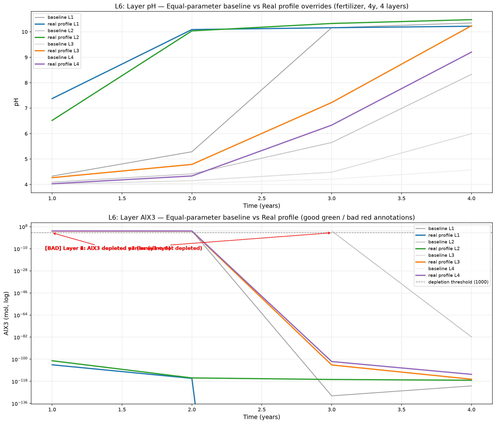

# L6 — 逐层参数覆盖（layer_overrides）实现与诊断

> **版本**：v0.4.0（L6 落地）
> **来源**：工单 23 + spec 29 + 工单 30~35（/grilling 敲定 10 项设计决策）
> **目标**：config 支持逐层参数覆盖（ph/有机质/容重/CEC/交换性离子/矿物/pCO₂ + layer_depths），真实剖面约束下的 fertilizer 行为诊断——L9 唯一未被证伪的结构性方向。

---

## 1. 背景：L9 证伪链 → L6

L9 完整证伪链（`docs/reports/V0_3_0_FINAL_REPORT.md` 第六节）确认：fertilizer 单层 AlX₃ 耗尽是**模型架构层局限**（排水淋失主因）。MINERAL_SCALE 扫描、非晶质相、预平衡、缺口修正、AlX₃ 交换 log_k、Al KINETICS **全部无效**。**仅多层 + L6 逐层参数未被证伪**（多层已验证推迟耗尽 y2→y4）。

## 2. 设计决策（10 项，2026-08-17 /grilling）

| # | 决策 | 结论 |
|---|------|------|
| Q1 | 配置格式 | config 内联 YAML 密集列表（与 survey/-1 回退模式一致） |
| Q2 | 覆盖粒度 | 部分覆盖 + 默认回退（只写有差异的层与字段） |
| Q3 | 单层行为 | `n_layers=1` 时忽略 + 警告（单层回归护栏） |
| Q4 | layer_depths | 一并落地；每层 `effective_depth = layer_depths[i]` |
| Q5 | 列表校验 | 密集列表长度必须 = n_layers；越界/值域非法报错 |
| Q6 | 矿物覆盖 | 增量替换质量分数 + 不归一化 + 总和≠1 警告 |
| Q7 | 预平衡 | 每层独立 `pre_equilibrate`（覆盖后 profile 作观测锚定） |
| Q8 | pCO₂ 月度 | `run_monthly_multi_layer` 按层注入 `layer_forcing['pCO2']` |
| Q9 | 覆盖字段 | ph / organic_matter / cec / bulk_density / 交换性离子×6 / pCO2 / minerals |
| Q10 | 诊断实验 | 真实剖面 vs 等参基线 + 图片标注 good/bad influence |

## 3. 配置结构（示例）

```yaml
simulation:
  n_layers: 4
  layer_depths: [10, 10, 20, 20]
  layer_overrides:
    - ph: 4.5
      organic_matter: 30.0
      cec: 15.0
      bulk_density: 1.1
      exch_al: 3.0
      pCO2: 0.020
      minerals: {goethite: 0.10}
    - {}
    - cec: 10.0
      bulk_density: 1.35
    - bulk_density: 1.5
      pCO2: 0.030
```

## 4. 实现要点

- **层厚物理含义**：`effective_depth` 是层缓冲库容量（交换位点/矿物/溶液体积）的线性乘子，而排水量不随厚度缩放 → **淋失应力 ∝ 1/厚度**。层厚本身是模拟结果的重要参数。
- **现状修正**：此前多层各层 `effective_depth=30cm`（物理 120cm）但输出后缀等分 0~60cm——列名与实际厚度**错位**；L6 后 `effective_depth = layer_depths[i]`，后缀与物理一致。
- **L1 联动**：逐层 `organic_matter` 为 L1 Al 表面络合（`M_有机质`）预留字段（`docs/analysis/L1_AL_SURFACE_METHOD.md`）。
- **月度 pCO₂**：GAS_PHASE 固定分压按层注入，表层低/底层高的剖面梯度全程保持。

## 5. 诊断实验（tools/plot_L6_layer_overrides.py）

**案例**：`fertilizer` 长期 × 4 层，(A) 等参基线（各层默认）vs (B) 真实剖面（§3 配置）。

**输出**：`output/L6_layer_overrides_good_bad.png`（子图 1 各层 pH、子图 2 各层 AlX₃），逐层标注：

| 标注 | 判定（`impact_tag`） | 含义 |
|------|----------------------|------|
| [GOOD]（绿） | 真实剖面未耗尽而基线耗尽 / 耗尽年晚于基线 | 缓冲增强（高 CEC/有机质/矿物/厚层） |
| [BAD]（红） | 真实剖面耗尽而基线未耗尽 / 耗尽年早于基线 | 淋失加剧（薄表层/低 CEC/高 pCO₂ 酸化） |

**用法**：`python tools/plot_L6_layer_overrides.py [--years 30] [--layers 4] [--scenario fertilizer]`

### 实测诊断结果（2026-08-17，4 年 4 层，fertilizer）



| 层 | 等参基线耗尽 | 真实剖面耗尽 | 影响 |
|----|-------------|-------------|------|
| L1 表层 0-10cm | y3 | **y1** | [BAD] 更早耗尽（薄表层缓冲小 + 高 pCO₂） |
| L2 10-20cm | y4 | **y1** | [BAD] 更早耗尽 |
| L3 20-40cm | 未耗尽 | y3 | [BAD] |
| L4 40-60cm | 未耗尽 | y3 | [BAD] |

**表层 pH 末年**：等参基线 10.348 vs 真实剖面 10.219 → **[GOOD] 真实剖面抑制 pH 突升**（底层高 pCO₂ 碳酸缓冲 + 富铁氧化物 Al 缓冲）。

**科学解读**：真实剖面在本案例中表现为"加速交换 Al 耗尽（BAD）但抑制表层 pH 突升（GOOD）"并存——逐层参数使耗尽量与缓冲能力**解耦**（薄表层小缓冲库被相同排水量快速洗刷；深层 pCO₂/矿物提供缓冲使 pH 稳态更低）。这验证了 L6 的诊断价值：真实剖面约束改变了耗尽路径与 pH 稳定性，且 good/bad 必须同时如实报告。完整 30 年 4 层约需 1-2 分钟（本机实测 4 年 ≈ 11s）。

## 6. 科学诚实：局限与注意

- **不归一化**：矿物增量替换后质量分数总和 ≠ 1 时仅警告（覆盖意图不被归一化扭曲，用户负责剖面数据物理一致性）。
- **good/bad 均为模型行为如实标注**：真实剖面可能同时产生 good（某层缓冲增强）与 bad（薄层耗尽更快）影响，脚本逐层独立标注，不预设结论。
- **pCO₂ 温度响应（beta）未逐层**：本期仅固定分压逐层，beta 逐层差异化留给后续。
- **单层回归护栏**：`n_layers=1` 时 overrides 被忽略，既有单层行为与 133 项测试保持不变。
