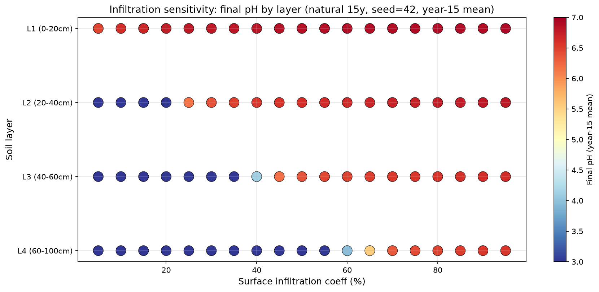

# SENSITIVITY — 表层入渗率敏感性实验（4层 × 15年 natural）

> **版本**：v0.5.1
> **方法**：/grilling 敲定（Q1~Q7）；脚本 `tools/sensitivity_infiltration.py`
> **目的**：在所有参数固定（4 层内置水文默认剖面、seed=42、natural、15 年）下，表层入渗系数 5%~95%（5% 间隔，19 点）对 4 层土壤最终 pH（第 15 年年均）的影响。

---

## 1. 方法（决策）

| # | 决策 | 结论 |
|---|------|------|
| Q1 | 扫描参数 | `simulation.surface_infiltration_coeff`（v0.5.1 新增 config，默认 0.75），扫 0.05~0.95 |
| Q2 | 4 层剖面 | v0.5.0 内置水文默认（[20,20,20,40]cm + 粘粒/孔隙度/Ksat/初渗-稳渗） |
| Q3 | 最终 pH | 第 15 年 12 个月各层 pH 均值 |
| Q4 | 运行 | 单点 + CSV 断点累积；随机降雨 seed=42 固定（唯一变量=入渗系数） |
| Q6 | 散点图 | RdYlBu_r、固定区间 3.0~7.0、横=入渗率%、纵=4 层、色=pH |

**结果文件**：`output/sensitivity_infiltration.csv`（19 行）+ `output/sensitivity_infiltration_scatter.png`

## 2. 结果

| 入渗系数 | L1 (0-20cm) | L2 (20-40cm) | L3 (40-60cm) | L4 (60-100cm) |
|---------|-------------|--------------|--------------|---------------|
| 0.05 | 6.46 | 2.72 | 2.70 | 2.69 |
| 0.10 | 6.62 | 2.72 | 2.70 | 2.69 |
| 0.15 | 6.70 | 2.72 | 2.70 | 2.69 |
| 0.20 | 6.75 | 2.89 | 2.70 | 2.69 |
| 0.25 | 6.78 | **6.16** | 2.70 | 2.69 |
| 0.30 | 6.81 | 6.39 | 2.70 | 2.69 |
| 0.35 | 6.83 | 6.49 | 2.70 | 2.69 |
| 0.40 | 6.84 | 6.57 | 2.70 | 2.69 |
| 0.45 | 6.85 | 6.62 | 4.45 | 2.69 |
| 0.50 | 6.86 | 6.66 | 5.89 | 2.69 |
| 0.55 | 6.87 | 6.64 | 6.44 | 3.02 |
| 0.60 | 6.88 | 6.67 | 6.49 | 3.96 |
| 0.65 | 6.88 | 6.69 | 6.51 | 5.53 |
| 0.70 | 6.89 | 6.71 | 6.54 | 6.34 |
| 0.75 | 6.89 | 6.73 | 6.57 | 6.43 |
| 0.80 | 6.90 | 6.75 | 6.59 | 6.49 |
| 0.85 | 6.90 | 6.77 | 6.60 | 6.52 |
| 0.90 | 6.91 | 6.79 | 6.61 | 6.55 |
| 0.95 | 6.91 | 6.80 | 6.63 | 6.57 |

## 3. 科学解读

**关键发现：级联穿透的阈值响应（每层有独立的"入渗率穿透阈值"）**

| 层 | 穿透阈值（pH 突跃点） | 解读 |
|----|----------------------|------|
| L1 表层 0-20cm | 始终 6.5~6.9（无阈值） | 入渗水（pH 5.75 降水 + 碳酸 HCO₃⁻ 缓冲）直接接触表层，pH 高位稳定；随入渗率缓升（缓冲增强） |
| L2 20-40cm | **~0.25**（2.72→6.16 突跃） | 入渗率 > 0.25 后入渗水显著穿透到达 L2，中和强酸（2.7） |
| L3 40-60cm | **~0.45**（2.70→4.45） | 更高入渗率（>0.45）穿透到 L3（Ksat=7.2 cm/day 更慢） |
| L4 60-100cm | **~0.65**（2.69→5.53） | 入渗率 > 0.65 才显著影响最深层（Ksat=2.9 cm/day + 厚 40cm 持水缓冲） |

**物理解释**：4 层垂直结构（Ksat 递减 76.8→2.9 cm/day、孔隙度递减、厚度递增）形成"入渗水穿透深度"的阶梯——入渗率越高，穿透越深；每层被中和的阈值 = 该层土壤缓冲（Ksat 与持水）决定。低入渗率（5%~20%）时入渗水不足以穿透 L1，L2~L4 保持强酸（~2.7，矿物酸缓冲主导）。

**垂直差异**：表层始终中性偏碱（6.5+，碳酸缓冲），深层在低入渗率下强酸（2.7）——入渗率是控制"酸化/脱酸剖面"的关键参数。

## 4. 局限与注意

- **pH 绝对量偏高**：表层 ~6.9 与真实红壤（4~5）偏离——0.75 系数/稳渗率/降雨历时假设的固有结果（HYDROLOGY_BOX.md §5 已记录），**趋势与阈值结构是主要信息，绝对 pH 需结合研究区标定**。
- **L2~L4 的 2.70 恒定**：强酸稳态可能由矿物缓冲（非晶质 Al(OH)₃ 溶解下限）锚定。
- **单层不适用**：n_layers=1 无此水文（precip_infiltration 路径）。
- **seed 敏感性**：结果依赖 seed=42 的降雨序列；换 seed 会改变阈值精确位置但结构（阶梯穿透）应保持。

> **⚠️ 2026-08-21 核对注记（v0.5.1 实验快照）**：
> - 扫描参数 `simulation.surface_infiltration_coeff` 已于 **v0.5.2 废弃**（Green-Ampt 物理入渗替代，残留配置显式报错）；本文"入渗系数"即该废弃参数，不可再用于当前版本。
> - 文中 L3/L4 Ksat（7.2 / 2.9 cm/day）与"Ksat 递减 76.8→2.9"为 **v0.5.1 时期剖面默认**；v0.5.2 起 `DEFAULT_4LAYER_KSAT=[12.0, 1.9, 0.48, 0.05]`（层间排水）+ `DEFAULT_KSAT_SURFACE=7.2`（地表入渗）。
