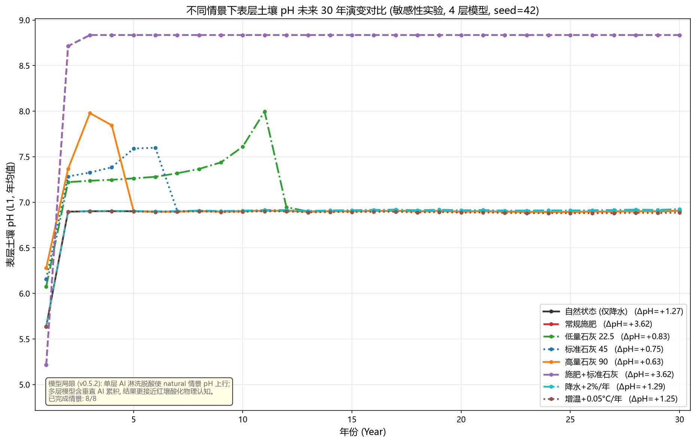

# SENSITIVITY — 表层土壤 pH 未来 30 年情景敏感性实验（4 层 × 30 年）

> **版本**：v0.5.2
> **方法**：脚本 `tools/sensitivity_pH_30yr.py`
> **目的**：在统一框架下（4 层内置红壤物理剖面、Green-Ampt 水文、seed=42 固定、预平衡开启）比较 **8 种情景**下表层（L1, 0–20cm）土壤年均 pH 未来 **30 年**的演变，识别管理措施与气候强迫的敏感性。

---

## 1. 情景与模型设置

| # | 情景 | 干预 | 变量 |
|---|------|------|------|
| S1 | `natural` | 仅降水（基线，无干预） | — |
| S2 | `fertilizer` | 常规化肥（3/6/9 月 N 12 / P₂O₅ 4 / K₂O 9 / MgO 3 / ZnSO₄ 1 kg/ha/次） | 施肥 vs 不施肥 |
| S3 | `lime_low` | 生石灰 22.5 kg CaO/ha/次（3/6/9 月） | 石灰量敏感性 |
| S4 | `lime_mid` | 生石灰 45 kg CaO/ha/次 | 石灰量敏感性 |
| S5 | `lime_high` | 生石灰 90 kg CaO/ha/次 | 石灰量敏感性 |
| S6 | `fertilizer_lime` | 化肥 + 标准石灰 45 kg | 综合改良 |
| S7 | `precip_increase` | 降水 +2%/年（30 年累计 +80%，气候强迫） | 气候敏感性 |
| S8 | `temp_increase` | 增温 +0.05 °C/年（30 年 +1.5 °C，气候强迫） | 气候敏感性 |

**模型设置**：`n_layers=4`（v0.5.2 内置剖面 [20,20,20,40]cm，Ksat 递减）；Green-Ampt 入渗（`ksat_surface`=7.2 cm/day，`bypass_fraction`=0.2）；随机降雨 seed=42 **固定**（各情景逐场降雨分配一致，差异纯来自干预/气候）；初始状态预平衡 60 步（与 `main.py` 默认一致）；官方 PHREEQC 引擎（`phreeqc.dat`，失败自动降级简化模式）。肥料/石灰量与月份沿用 `config/config.yaml` 与 `scenario_controller.py` 默认值。

**结果文件**：`output/sensitivity_pH_30yr.csv`（8 情景 × 30 年 = 240 行，断点续跑）+ `output/sensitivity_pH_30yr.png`（全部曲线同图）。

## 2. 结果

| 情景 | 第1年 | 第10年 | 第20年 | 第30年 | ΔpH₃₀ |
|------|------|--------|--------|--------|-------|
| natural | 5.637 | 6.902 | 6.898 | 6.907 | +1.270 |
| fertilizer | 5.215 | 8.835 | 8.835 | 8.835 | +3.620 |
| lime_low | 6.076 | 7.611 | 6.899 | 6.906 | +0.830 |
| lime_mid | 6.159 | 6.902 | 6.899 | 6.906 | +0.747 |
| lime_high | 6.280 | 6.902 | 6.899 | 6.906 | +0.626 |
| fertilizer_lime | 5.215 | 8.835 | 8.835 | 8.835 | +3.620 |
| precip_increase | 5.637 | 6.909 | 6.913 | 6.926 | +1.289 |
| temp_increase | 5.637 | 6.896 | 6.886 | 6.887 | +1.250 |

> 表中 pH 为 L1 每年 12 个月的算术均值。完整逐年数据见 CSV。

## 3. 敏感性解读

**管理措施（前期）**：干预在第 1 年即显著区分——施肥产酸使首年 pH 最低（5.22），石灰中和使首年 pH 随施量抬升（22.5/45/90 kg → 6.08/6.16/6.28），**首年对石灰量近似线性敏感（≈+0.07 pH / 22.5 kg）**。施肥情景因硝化产酸（2H⁺/mol N）首年即比基线低 0.42 pH。

**中后期收敛**：除化肥情景外，各情景第 10 年后均收敛至 ~6.9 的碳酸盐缓冲稳态——表层交换性 Al 被淋洗/矿物化耗尽后，系统转入 HCO₃⁻ 主导的缓冲平台（v0.5.2 已知现象，见 §4）。因此 **30 年尺度下石灰量与气候的持久效应均弱于前期**，长期敏感性主要体现在路径差异（石灰推迟酸化平台到达）而非平台值。

**化肥情景的突升**：`fertilizer`/`fertilizer_lime` 在第 10 年 pH 突升至 8.835 并恒定——持续施肥加速表层 AlX₃ 耗尽，耗尽后无强酸源缓冲，pH 跳到碳酸盐/碱端平台。这是模型已记录的数值特征（多层模型将单层的第 8 年突升推迟至第 10 年），**不能解释为真实土壤会碱化**。

**气候敏感性弱**：降水 +2%/年与增温 +0.05 °C/年对表层 pH 影响很小（第 30 年与基线相差 <0.02 pH）——稳态由碳酸缓冲锚定，降水/温度主要改变中间路径而非平台值。

## 4. 局限与注意

- **pH 绝对量偏高**：各情景表层最终 ~6.9（化肥 ~8.8）与真实红壤（4~5）偏离——降水化学入渗强度、Al 淋洗脱酸、碳酸缓冲假设的固有结果（`SENSITIVITY_INFILTRATION.md` §4 已记录同类现象）。**趋势与相对差异是主要信息，绝对 pH 需结合研究区标定**。
- **AlX₃ 耗尽突升**：化肥情景 pH 突升为模型已知局限（README v0.5.2 / `V0_3_0_FINAL_REPORT.md`），深层垂直 Al 运移缓解但未消除。
- **seed 敏感性**：结果依赖 seed=42 的逐场降雨分配；换 seed 改变精确路径，但情景相对排序应保持。
- **单层不适用**：本实验使用 4 层水文模式；`n_layers=1` 无 Green-Ampt 水文路径。
- **预平衡影响**：预平衡（60 步观测锚定）显著改变初始状态（初始 L1 pH 4.92 → 首年年均 5.64），与 `main.py` 默认行为一致；`--skip-pre` 可对比。
