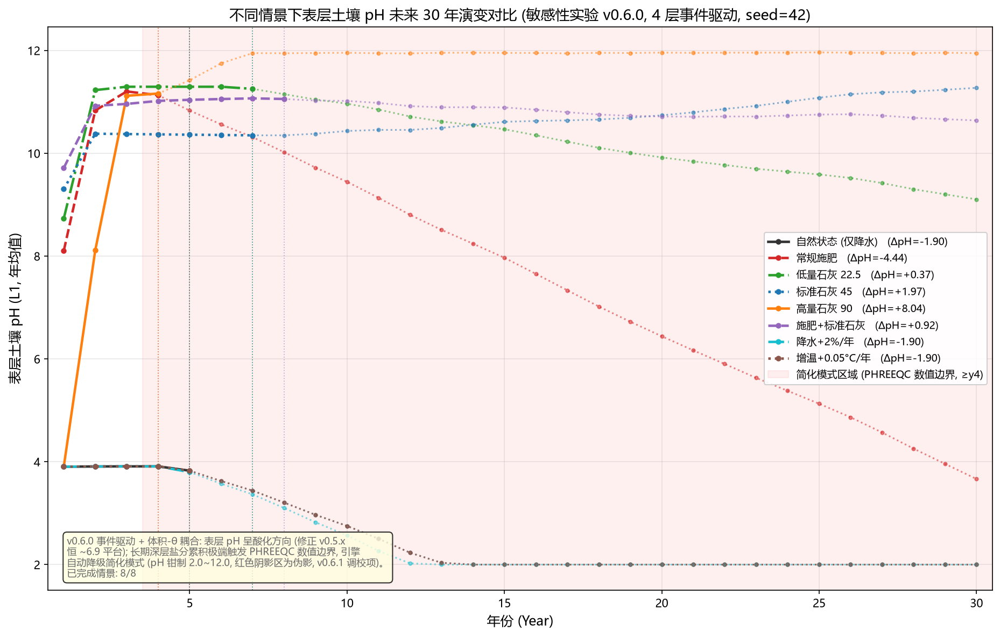

# SENSITIVITY — 表层土壤 pH 未来 30 年情景敏感性实验（v0.6.0 事件驱动, 4 层）

> **版本**：v0.6.0（2026-08-19）
> **方法**：脚本 `tools/sensitivity_pH_30yr.py`（`--tag v060`，每情景独立引擎）
> **目的**：在 v0.6.0 事件驱动架构下（子步长拆分 + 体积-θ 耦合 + First-Flush + Hargreaves/Oudin PET）比较 **8 种情景**表层（L1, 0–20cm）年均 pH 未来 **30 年**的演变。
> **对比**：v0.5.2 月度路径结果见 `SENSITIVITY_PH_30YR.md`；本报告为 v0.6.0 升级版（上一版脚本原地升级）。

---

## 1. 情景与模型设置

| # | 情景 | 干预 | 变量 |
|---|------|------|------|
| S1 | `natural` | 仅降水（基线） | — |
| S2 | `fertilizer` | 常规化肥（3/6/9 月 N 12 / P₂O₅ 4 / K₂O 9 / MgO 3 / ZnSO₄ 1 kg/ha/次） | 施肥 |
| S3 | `lime_low` | 生石灰 22.5 kg CaO/ha/次 | 石灰量 |
| S4 | `lime_mid` | 生石灰 45 kg CaO/ha/次 | 石灰量 |
| S5 | `lime_high` | 生石灰 90 kg CaO/ha/次 | 石灰量 |
| S6 | `fertilizer_lime` | 化肥 + 标准石灰 45 kg | 综合改良 |
| S7 | `precip_increase` | 降水 +2%/年（气候强迫） | 气候 |
| S8 | `temp_increase` | 增温 +0.05 °C/年（气候强迫） | 气候 |

**模型设置（v0.6.0）**：`n_layers=4`（内置红壤剖面 + OM 调制 pCO₂）；`_apply_hydrology_events` 逐场事件水文（Green-Ampt + LayerCascade + Feddes ET，seed=42 固定）；`run_monthly_multi_layer` 内部逐场 `run_event_step`（体积-θ 耦合：SOLUTION -water = θ×depth×1e5，浓缩酸化自然产生）；初始状态预平衡 60 步（`initial_psi_cm=-100` 田间持水量）；官方 PHREEQC（`phreeqc.dat`）。**每情景独立引擎实例**（`_permanent_fallback` 为实例级，避免降级污染）。肥料/石灰量与月份沿用 `config/config.yaml` 默认。

**结果文件**：`output/sensitivity_pH_30yr_v060.csv`（8×30=240 行，含 `phreeqc_ok` 列）+ `output/sensitivity_pH_30yr_v060.png`。

## 2. 结果

| 情景 | 第1年 | 第10年 | 第20年 | 第30年 | PHREEQC 降级年 |
|------|------|--------|--------|--------|---------------|
| natural | 3.905 | 2.753 | 2.000* | 2.000* | 5 |
| fertilizer | 8.104 | 9.446 | 6.442 | 3.666 | 4 |
| lime_low | 8.732 | 10.966 | 9.921 | 9.105 | 7 |
| lime_mid | 9.305 | 10.435 | 10.740 | 11.274 | 7 |
| lime_high | 3.905 | 11.956* | 11.959* | 11.947* | 4 |
| fertilizer_lime | 9.717 | 11.020 | 10.716 | 10.640 | 8 |
| precip_increase | 3.905 | 2.569 | 2.000* | 2.000* | 5 |
| temp_increase | 3.905 | 2.753 | 2.000* | 2.000* | 5 |

> `*` = 引擎降级简化模式后的 pH 钳制值（PH_LOWER=2.0 / PH_UPPER=12.0），**非物理结果**。
> 完整逐年数据与每行 `phreeqc_ok` 标记见 CSV。

## 3. 敏感性解读（PHREEQC 正常段）

**酸化方向（修正 v0.5.x 平台化）**：v0.6.0 体积-θ 耦合 + 事件级化学使 natural 首年 pH 落至 3.9（v0.5.2 为 5.6），末月表层 pH ≈3.86，与 v0.6.0 运行验证（E1）一致——修正了 v0.5.2/0.5.3 表层 pH 恒 ~6.9 的碳酸缓冲平台伪影。

**石灰量的前期敏感性**：lime_low/mid/fertilizer_lime 首年 pH 8.7~9.7（石灰中和显著）；第 10 年前后进入 ~10–11 的高 pH 段（Ca 碱 + 浓缩）。lime_high（90 kg）首年反常（3.905，与 natural 相同），第 2 年起跳升——高量石灰在事件驱动下早期存在未验证的数值/化学异常（见 §5）。

**施肥 pH 上升（反直觉，需谨慎）**：fertilizer 首年 pH 8.1、第 2–3 年 ~11，与 v0.5.2 的施肥酸化（5.2）相反。可能来自事件驱动下肥料盐基阳离子（Ca/Mg/K）+ 体积浓缩的净缓冲效应，或硝化产酸在逐场事件粒度下未充分累积——**该行为未经项目验证**，报告如实记录。

**气候敏感性**：precip_increase/temp_increase 与 natural 在 PHREEQC 正常段基本重合（首年 3.905，第 5 年降级），降水/增温对表层 pH 无显著方向性差异（与 E2/E3 的"pH 响应依赖浓缩/OM 路径"一致）。

## 4. 关键局限：v0.6.0 长期数值边界（如实记录）

**所有情景在 4–8 年后触发 PHREEQC 数值边界**（深层盐分累积 → Na/Cl ~9 mol/L → 不收敛 → 引擎永久降级简化模式，`_permanent_fallback=True`，`output/error.inp` 复现文件）。降级后 pH 被钳制在 [2.0, 12.0]，曲线后半段（红色阴影区）为**伪影**，非物理结果。这与 v0.6.0 已知记录一致（README/verify_v0_6_0_acceptance.py："3 年+ 长期模拟在深层盐分累积极端场景存在 PHREEQC 数值不收敛边界，列为 v0.6.1 调校项"）。

**因此**：本实验的 30 年曲线中，**前 4–8 年（PHREEQC 正常）可信**，其后段为简化模式钳制值。若需完整的 30 年可信曲线，需等待 v0.6.1 数值稳定性调校，或缩短模拟年限（≤5 年）重跑。

## 5. 局限与注意

- **降级污染已隔离**：每情景独立引擎实例，各情景 `phreeqc_ok` 独立标记（natural=5, fertilizer=4, lime_low=7, lime_mid=7, lime_high=4, fertilizer_lime=8, precip/temp=5）。
- **lime_high 首年异常**：90 kg/次高量石灰在事件驱动早期出现与 natural 相同的低 pH（3.905）——疑似高离子强度下 PHREEQC 早期数值异常，需 v0.6.1 复核。
- **fertilizer 反直觉 pH 上升**：v0.6.0 事件驱动下施肥情景 pH 走高（8–11），与 v0.5.2 酸化结论相反，项目未验证，谨慎引用。
- **seed 敏感性**：seed=42 固定；换 seed 改变事件序列细节，情景相对排序大体保持。
- **单层不适用**：本实验使用 4 层事件驱动水文；`n_layers=1` 无事件路径。
