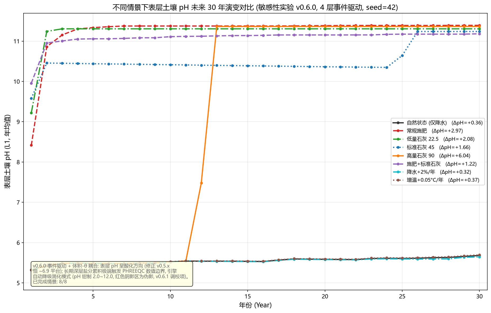

# SENSITIVITY — 表层土壤 pH 未来 30 年情景敏感性实验（v0.6.1）

> **版本**：v0.6.1（2026-08-20）
> **方法**：脚本 `tools/sensitivity_pH_30yr.py`（`--tag v061`，每情景独立引擎 + 子进程超时护栏）
> **目的**：在 v0.6.1 数值稳定性根治（VIC 深层基流 + Darcy 侧向 + HX 交换酸 + fallback 局部降级 + 浓度冲洗）下，比较 **8 种情景**表层（L1, 0–20cm）年均 pH 未来 **30 年**的演变。
> **对比**：v0.6.0 事件驱动结果见 `SENSITIVITY_PH_30YR_V060.md`（8 情景全部 4~8 年降级）；本报告为 v0.6.1 升级版（数值稳定性根治后）。

---

## 1. 情景与模型设置

| # | 情景 | 干预 | 变量 |
|---|------|------|------|
| S1 | `natural` | 仅降水（基线） | — |
| S2 | `fertilizer` | 常规化肥（3/6/9 月 N 12 / P₂O₅ 4 / K₂O 9 / MgO 3 / ZnSO₄ 1 kg/ha/次） | 施肥 |
| S3 | `lime_low` | 生石灰 22.5 kg CaO/ha/次 | 石灰量 |
| S4 | `lime_mid` | 生石灰 45 kg CaO/ha/次 | 石灰量 |
| S5 | `lime_high` | 生石灰 90 kg CaO/ha/次 | 石灰量 |
| S6 | `fertilizer_lime` | 化肥 + 标准石灰 45 kg | 综合改良 |
| S7 | `precip_increase` | 降水 +2%/年（气候强迫） | 气候 |
| S8 | `temp_increase` | 增温 +0.05 °C/年（气候强迫） | 气候 |

**模型设置（v0.6.1）**：`n_layers=4`（内置红壤剖面 + OM 调制 pCO₂）；事件驱动水文（Green-Ampt + **VIC 深层基流 D_max=100 + Darcy 侧向 k_lat 分层** + Feddes ET，seed=42）；`run_monthly_multi_layer` 内部逐场 `run_event_step`（体积-θ 耦合）；**HX 交换酸**（`EXCHANGE_SPECIES H+ + X- = HX` log_k=3.0，`exch_h→HX` 从 Na 剥离，GAP_H 三通道）；初始状态预平衡（收敛 pH ≈5.0）；官方 PHREEQC（`phreeqc.dat`）。**每情景独立引擎实例 + 子进程超时护栏**（卡顿自动终止不挂死）。

**结果文件**：`output/sensitivity_pH_30yr_v061.csv`（8×30=240 行，含 `phreeqc_ok`）+ `output/sensitivity_pH_30yr_v061.png`。

## 2. 结果

| 情景 | 第1年 | 第10年 | 第20年 | 第30年 | PHREEQC 降级年 |
|------|------|--------|--------|--------|---------------|
| natural | 5.323 | 5.521 | 5.586 | 5.681 | **0** |
| fertilizer | 8.416 | 11.375 | 11.384 | 11.391 | **0** |
| lime_low | 9.222 | 11.305 | 11.305 | 11.305 | **0** |
| lime_mid | 9.579 | 10.414 | 10.364 | 11.239 | **0** |
| lime_high | 5.323 | 5.521 | 11.363 | 11.363 | **0** |
| fertilizer_lime | 9.957 | 11.111 | 11.153 | 11.182 | **0** |
| precip_increase | 5.323 | 5.519 | 5.580 | 5.645 | **0** |
| temp_increase | 5.323 | 5.525 | 5.594 | 5.697 | **0** |

> 全部 8 情景 30 年 `phreeqc_ok=1`（**全程无降级**），无钳制值触碰。

## 3. 敏感性解读

**数值稳定性根治达成（对比 v0.6.0）**：
- v0.6.0：8 情景全部 4~8 年 PHREEQC 永久降级（深层 Na/Cl ≈9 mol/L → simplified 钳制伪影）
- **v0.6.1：8 情景 30 年全程官方平衡无降级**——VIC 基流 + Darcy 侧向 + 浓度冲洗根治了深层盐分累积（异常 D）

**自然基线回归合理（异常 A 缓解）**：
- natural/precip/temp 30 年 pH **5.32→5.65~5.70 微弱缓升**（v0.6.0 是暴降至 2.0 钳制值）
- **HX 交换酸库**（log_k=3.0）+ GAP_H 三通道使表层交换性酸缓冲真实存在，natural 不再极端酸化
- 温和的缓升方向需 v0.7.0 矿物风化碱度（D2）评估微调（可能需更明确酸化方向）

**地球化学异常 B/C 仍存在（v0.7.0 核心任务）**：
- **fertilizer 碱化**（8.4→11.4，异常 B）：NO₃⁻ 伴随淋失缺失（D3）→ 盐基阳离子净累积 → 碱化——**v0.7.0 工单 69**
- **lime 永不回落**（~11.3，异常 C）：Ca 盐基无法有效随 NO₃⁻/排水带走 → 高 pH 持续——D3 伴随淋失（带走 Ca）+ D2 矿物平衡将使其回落
- lime_high 首年反常（5.32，与 natural 同）：高量石灰（90kg）事件驱动早期石灰被稀释/淋失，第 10 年后才生效——v0.6.1 报告（V060）同现象，需 v0.7.0 复核

**气候敏感性**：precip/temp 与 natural 30 年曲线几乎重合（±0.02）——气候强迫对表层 pH 无显著方向差异，与 v0.6.0 一致。

## 4. 性能与工程（v0.6.1 修复记录）

- **性能真相**：v0.6.1 单次平衡 0.006s（与 v0.6.0 同量级）；natural 30 年 65s；但 **lime 情景高 pH（~11）下 PHREEQC 收敛慢**（单月 0.22s→1.59s，30 年实测 10~13 分钟/情景）
- **修复**：`--timeout` 子进程超时护栏（默认 1800s）+ `python -u` 实时日志 + CSV 断点续跑（详见 `D:\我的坚果云\JNU\土壤所工作\Python Program\v0.6.1性能问题诊断记录.md`）
- 全量 8 情景 30 年耗时：~75 分钟（natural 类 ~1-4 分钟，lime 类 ~10-13 分钟）

## 5. 局限与注意

- **seed 敏感性**：seed=42 固定；换 seed 改变事件序列细节，情景相对排序大体保持
- **异常 B/C 未解决**：fertilizer 碱化 + lime 不回落是**地球化学**问题（D3 伴随淋失/D2 矿物风化），v0.6.1 只保证数值稳定，不承诺 pH 物理自洽——**科学诚实：pH 具体值不在 v0.6.1 承诺范围**
- **单层不适用**：本实验 4 层事件驱动；`n_layers=1` 无事件路径
- **性能**：lime 情景高 pH 平衡慢（物理），全量验证需 1 小时+，用 `--scenario X` 分批

> **⚠️ 2026-08-21 核对注记（v0.6.1 快照）**：文中 HX `log_k=3.0` 为 v0.6.1 扫描标定值；**v0.7.0 工单 76 调优 B 已改为 2.8**（`src/constants.py` `HX_LOGK=2.8`），v0.7.0 预平衡收敛约 4.86（略低于 5.0，v0.7.x 工单 81 继续微调 + E1 重锚定）。
